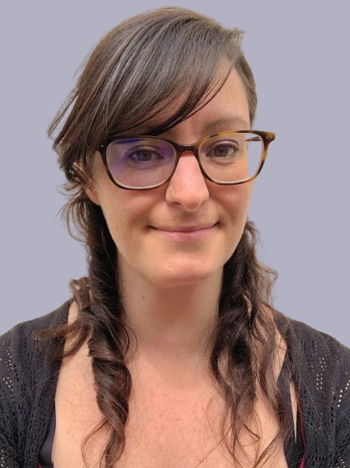

<!--  -->

I've worked in translation, web development, and IT support. That combination shapes how I approach knowledge problems: I understand the technical side, work directly with product teams, and write for international audiences without losing clarity.

Most of my clients are SaaS teams that have outgrown their informal knowledge setup. Content exists but it's scattered, outdated, or locked in someone's head. The fix isn't always more content. It's structure that holds up as the team grows.

I adapt to your existing tools rather than asking you to change them. Every engagement starts with a conversation before anything is scoped or agreed.

Based in southern France, working remotely with teams across Europe and beyond. English and French.

[Book a call](http://calendly.com/alison-combes/connect) | [Connect on LinkedIn](https://www.linkedin.com/in/alison-combes)  
