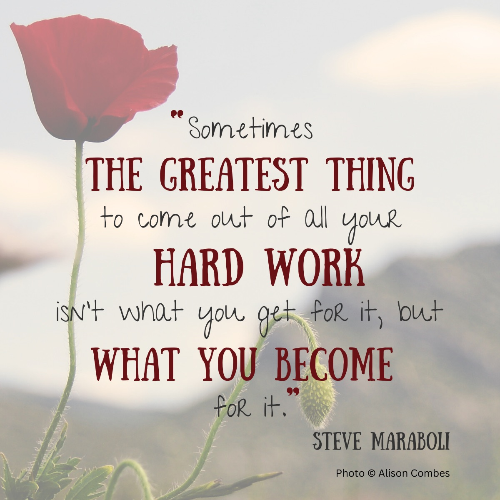

⏳ Given the amount of time we spend at work, it's no surprise that many people seek increased fulfilment in their professional lives by changing careers.

<!-- truncate -->

My own transition into web development has been a transformative and enriching experience, so I’d say this quote sums up my career change journey pretty well.

Here’s a very quick insight into what I’ve been learning and how I’ve grown in the process:

**Expanding Existing Skills**
- 💡 Adaptability
- 💡 Open-mindedness
- 💡 Resilience
- 💡 Creativity
- 💡 Problem solving

**Developing New Skills**
- 🌱 Analytical thinking
- 🌱 Curiosity
- 🌱 Innovation
- 🌱 Leadership

**Expanding Horizons**
- 🌟 Continuous learning
- 🌟 Personal growth
- 🌟 Increased intellectual stimulation
- 🌟 Enriching experiences

Overall, changing careers hasn’t only helped me gain technical skills, it’s also prepared me to face future challenges with confidence and determination. I’m excited to keep learning and growing in this dynamic field.

_Note: originally posted to LinkedIn_