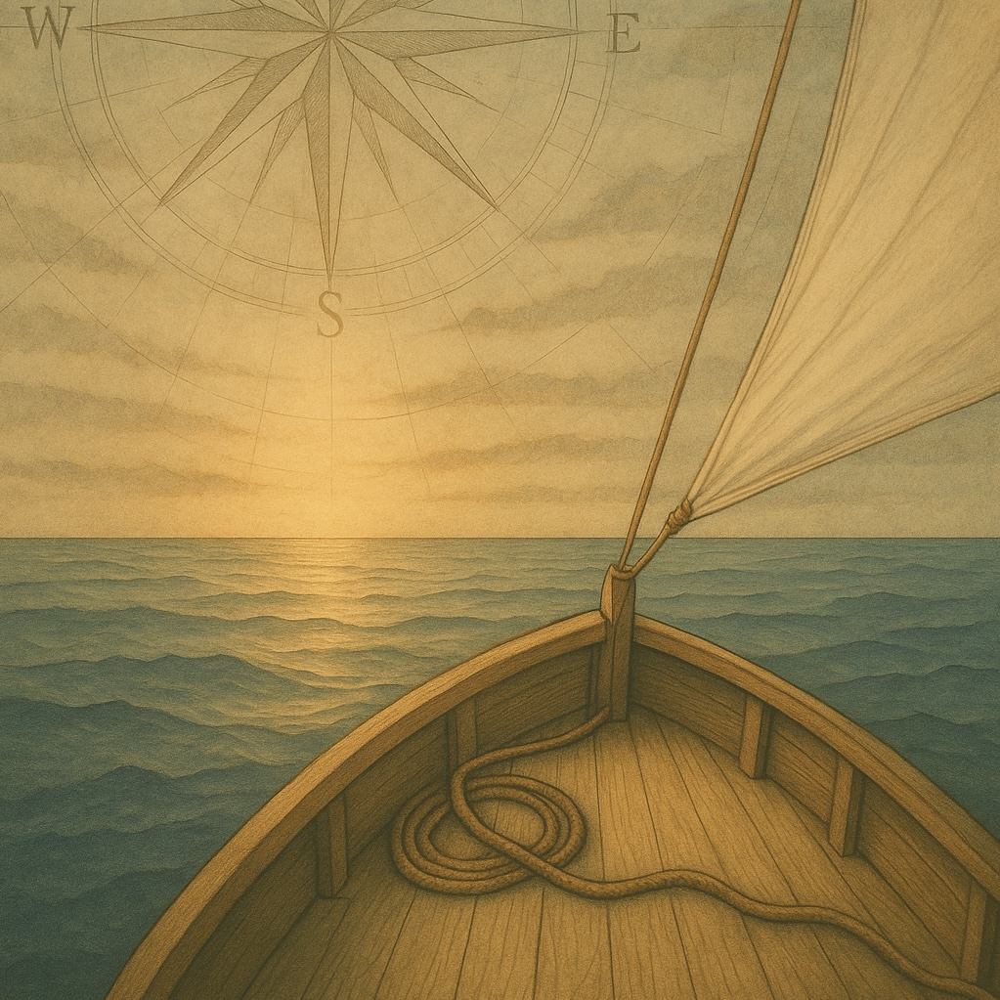

🧭 I didn’t know where I was going, just that I had to go.

About four years ago, I quit my job and made a big career change.

In those four years, I’ve learned a lot.

<!-- truncate -->

I’ve discovered more about myself: who I am, what I enjoy, and the kind of work that brings me energy and purpose.

I started by studying web development and exploring a range of technologies and tools.

Along the way:
- 🔍 I strengthened my research skills
- 🧠 I realised I have the ability to understand complex systems
- 🧩 I found that I really enjoy making sense of technical information

Working in tech support led me into technical writing, which turned out to be the perfect fit, combining communication, curiosity and technology in a way that really suits me.

One of the things that drew me to working in tech in the first place is how quickly things evolve.
As a writer, I’m constantly learning — keeping up with new tools and systems, deepening my understanding, and translating it all for people who might be seeing it for the first time.

I genuinely enjoy that kind of ongoing learning.

Looking back on these years of transition, and the moment I took that first step into the unknown, I’d definitely make the same choice again!

👉 Have you made a career change, or are you thinking about it?
What have you learned through the process?

_Note: originally posted to LinkedIn_