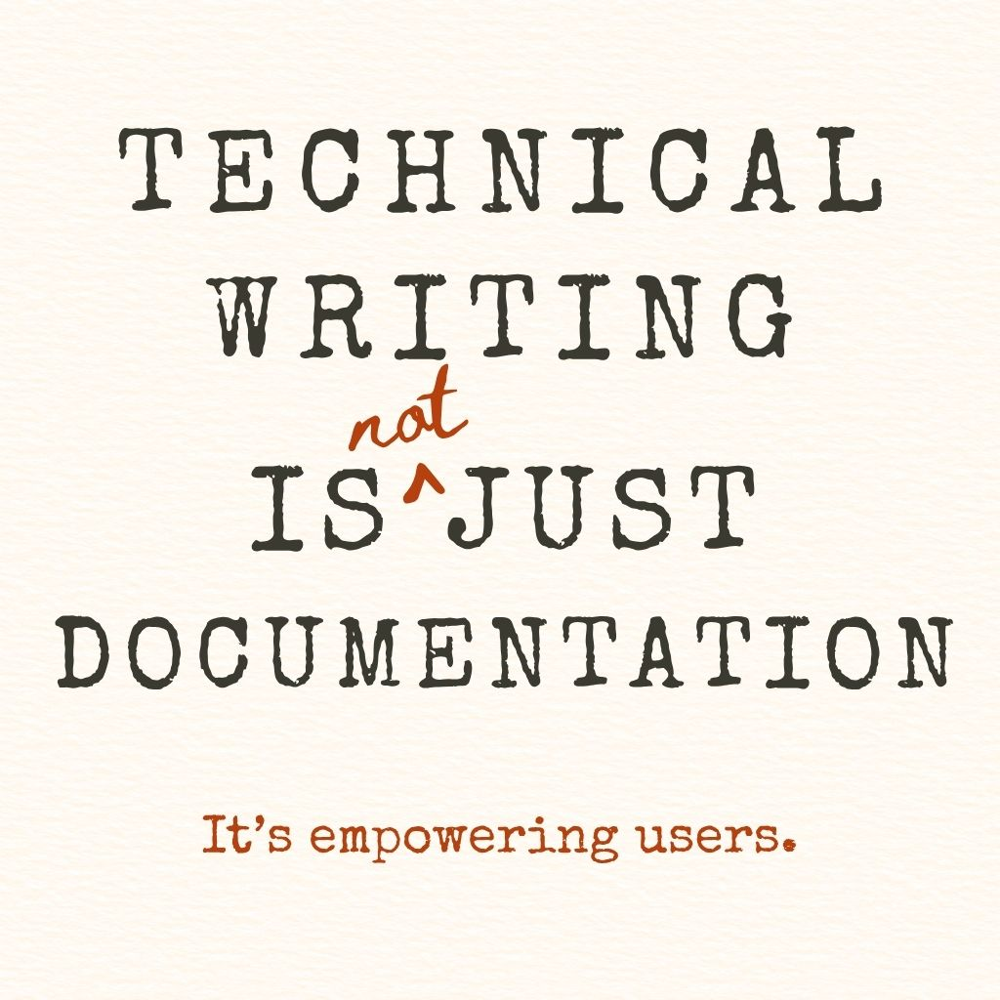
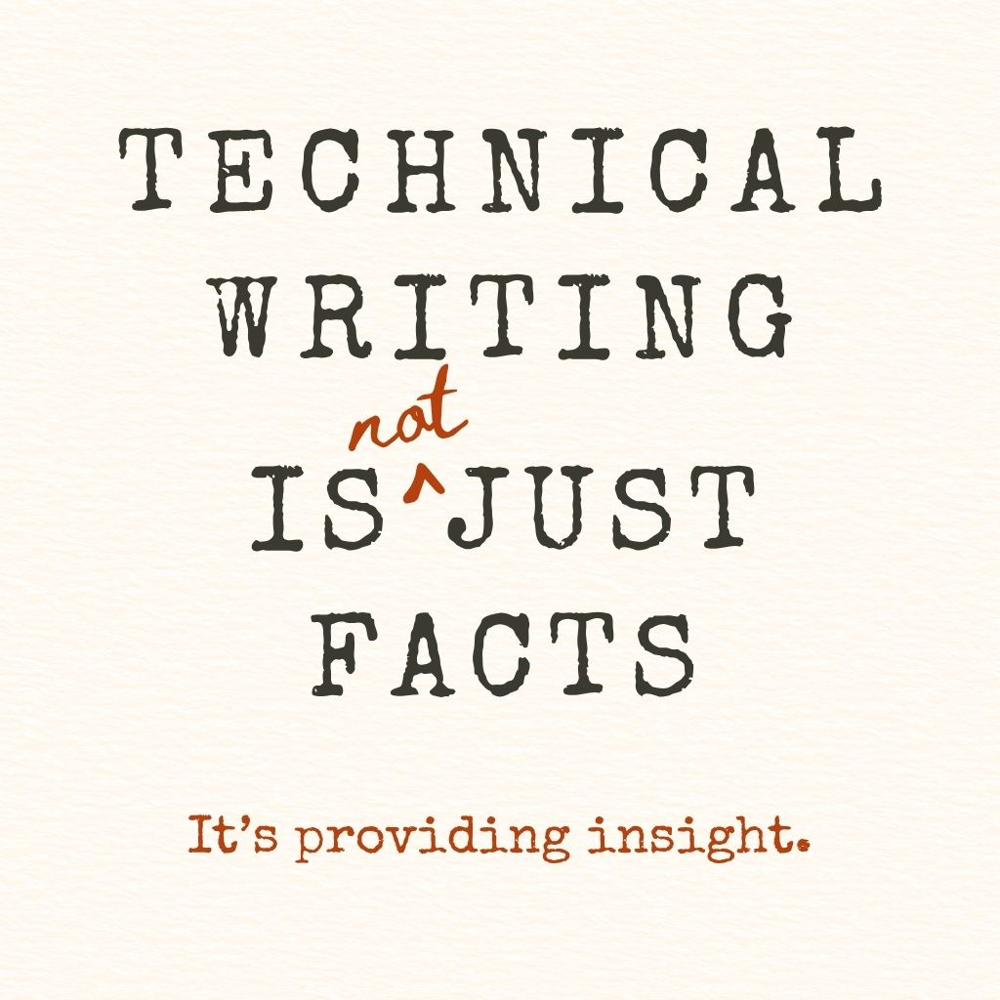
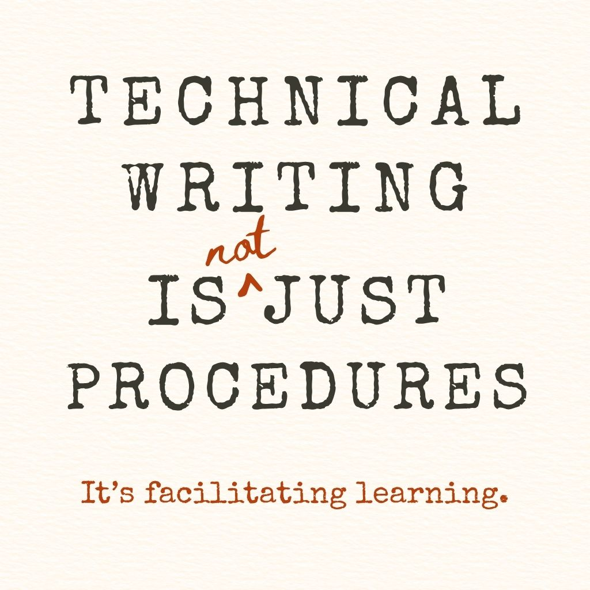
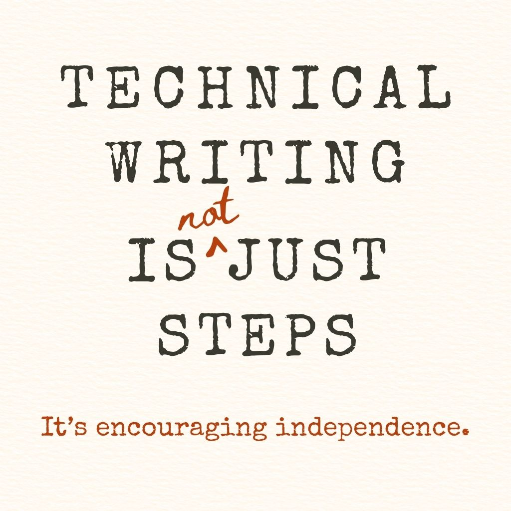
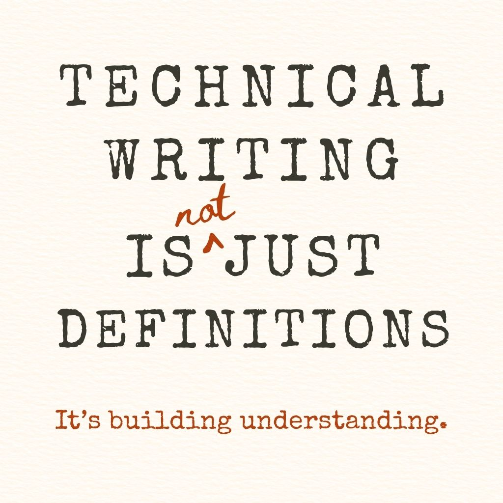
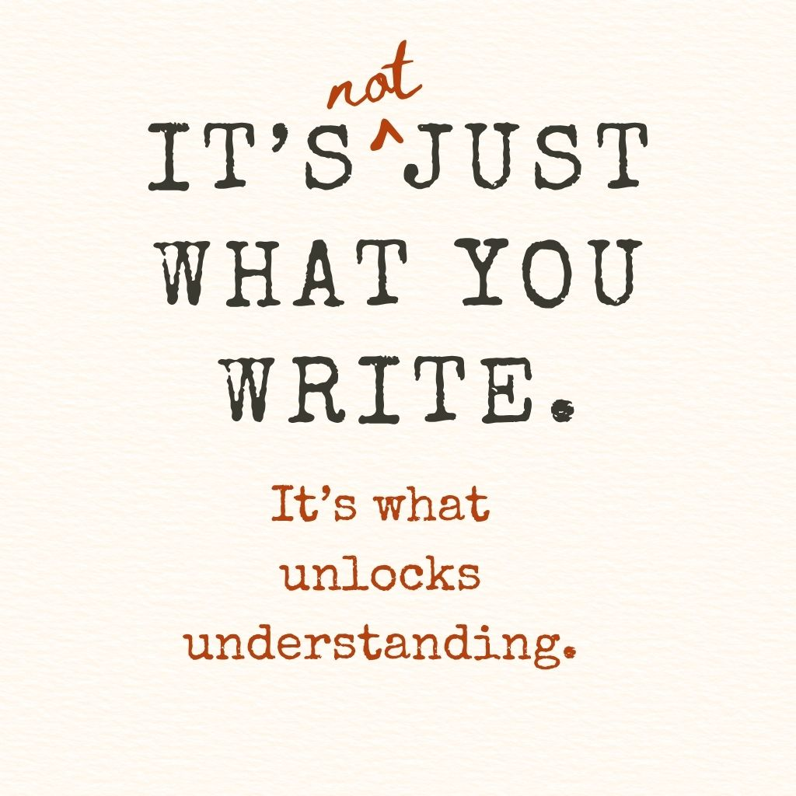

This started as a series of posts, but I wanted to bring the ideas together in one place.

<!-- truncate -->

Because technical writing isn’t just documentation, instructions, or definitions.
It’s a craft built around clarity, empowerment, and trust.

This isn't a full definition, but here’s a short visual guide to a few things I think matter in this field.

_Note: originally posted to LinkedIn_