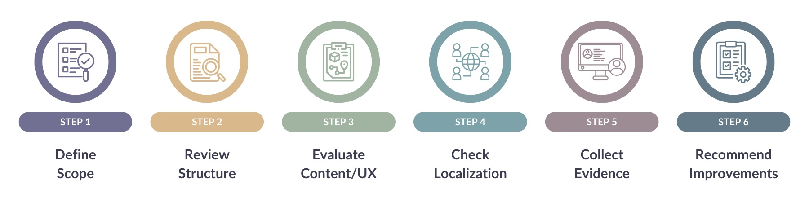
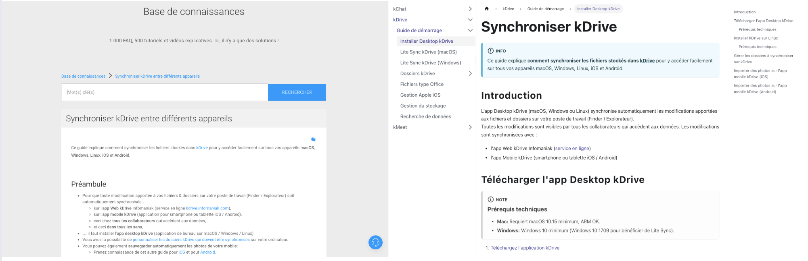
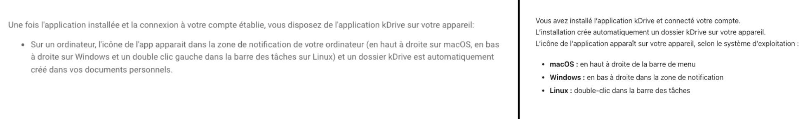
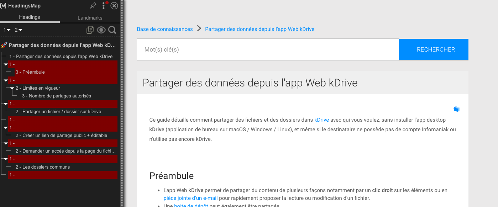
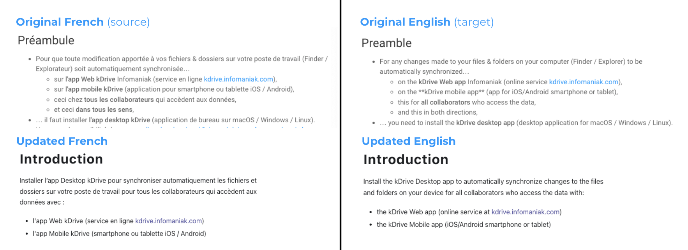

# Case Study: Mini-Audit

:::info
This case study highlights my approach to reviewing documentation clarity, translation impact, and usability. This is **not based on commissioned work**; all audited pages are publicly available from Infomaniak.
:::

## Overview

**Objective**  
Show how a focused documentation audit can surface issues in clarity, structure, and translation quality. This mini-audit of Infomaniak’s kDrive docs illustrates how even small documentation improvements can enhance usability, reduce support burden, and improve multilingual consistency.

**Scope**  

- Deep dive into one service: kDrive
- Light assessment of overall knowledge base information architecture (IA)
- Observations on multilingual/translation aspects (French → English)

**Limitations**  
Findings are illustrative, based on publicly available content.

---

## Methodology

Steps taken during the mini-audit:

---

## Key Insights

:::note
The full audit report contains detailed examples, screenshots, and actionable recommendations for each of these categories.
:::

###  Information Architecture  

- **Observation:** Navigation was inconsistent; users could get lost in deeper levels.
- **Recommendation:** Define clear user journeys and side menus for visibility.

  
*Example of improved information architecture: category grouping*

###  Content Quality

- **Observation:** Long sentences and unclear link text reduced readability.
- **Recommendation:** Rewrite with shorter sentences and clearer headings to improve clarity.

  
*Example of simplifying complex instructions (Before/After)*

###  User Experience (UX)

- **Observation:** Inconsistent formatting, e.g., heading hierarchy errors.
- **Recommendation:** Use consistent heading levels, bullets, and list formatting for accessibility.

  
*Heading map highlighting inconsistent heading levels*

###  Multilingual

- **Observation:** English translations frequently mirror French structure too literally, and updates sometimes lag behind.
- **Recommendation:** Create a multilingual glossary and synchronization process.

  
*Before/after example of literal English translation in kDrive docs*

---

## Takeaways

A documentation audit can deliver:

- **Quick wins:** standardize titles, add related links, fix formatting issues
- **Long-term improvements:** redesign IA, implement governance framework, improve multilingual workflows
- **Stronger user experience:** make content more findable, scannable, and accurate

---

## What I Learned

- How to apply audit frameworks to a limited-scope, real-world KB  
- Best practices for **multilingual documentation** and **translation governance**  
- Importance of using **evidence-based examples** (before/after screenshots)

---

## Next Steps

👉 Want to know how your docs perform?  
I provide tailored documentation audits: from quick health checks to full governance frameworks.

Set up a call via my [Calendly page](https://calendly.com/alison-combes/connect) to find out more.

---

## Full Report

[Download the full audit report (PDF)](./Demo-Audit-Report_Alison-Combes.pdf) with detailed findings, examples, and recommendations.

---